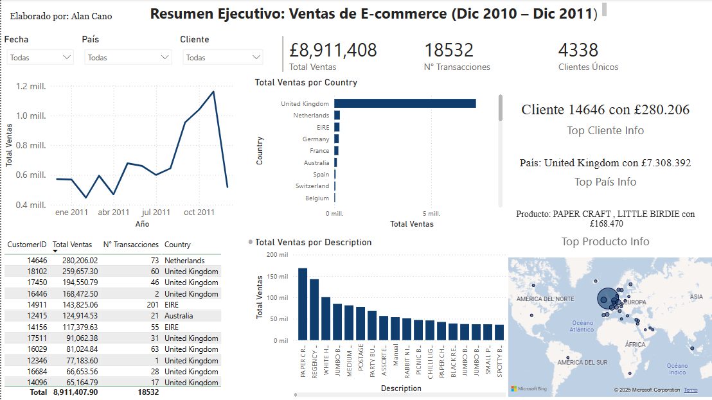

# 📦 Análisis de Datos de E-commerce

> Proyecto de análisis de transacciones de una tienda en línea utilizando Python, SQL Server y Power BI.  
> Incluye limpieza de datos, análisis exploratorio, segmentación de clientes y visualización interactiva.

## 📊 Objetivo

- Analizar el comportamiento de los clientes
- Detectar tendencias de ventas
- Identificar productos más vendidos
- Construir un dashboard ejecutivo con Power BI

## 🛠️ Tecnologías utilizadas

- Python (pandas, matplotlib, seaborn, scikit-learn)
- SQL Server (para almacenamiento y consulta de datos limpios)
- Jupyter Notebooks
- Power BI
- Git & GitHub


## 🗂️ Estructura del proyecto

 `````
analisis-ecommerce/
│
├── data/ # Datos originales y limpios
├── notebooks/ # Análisis exploratorio
├── src/ # Funciones reutilizables
├── dashboard/ # Power BI dashboard
├── README.md # Documentación del proyecto
├── requirements.txt # Dependencias
└── .gitignore
 `````


## 🚀 Cómo reproducir el proyecto

1. Clona el repositorio
2. Crea y activa un entorno virtual
3. Instala dependencias: `pip install -r requirements.txt`
4. Ejecuta los notebooks para explorar y limpiar los datos
5. Carga los datos limpios a una base de datos SQL Server
6. Abre `dashboard.pbix` en Power BI para ver la visualización


## 📈 Dashboard 

Dashboard interactivo construido en Power BI con indicadores clave de negocio, mapa geográfico y visualización dinámica.




## 🧠 Observaciones clave del análisis

- Las ventas están altamente concentradas en Reino Unido (más del 80%).
- Papel y productos de manualidades representan el top de ingresos.
- Cliente 14646 es el más importante, con más de £280,000 en ventas.
- La actividad de compra se intensifica entre septiembre y noviembre.


## 👤 Autor

- [Alan Arturo Cano Sanchez](https://www.linkedin.com/in/alan-arturo-cano-sanchez-511855361)
- Egresado de Ingeniería en Datos e Inteligencia Organizacional

